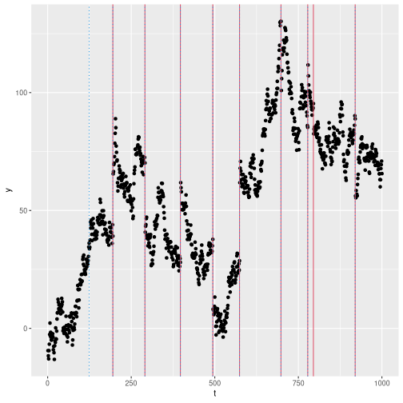
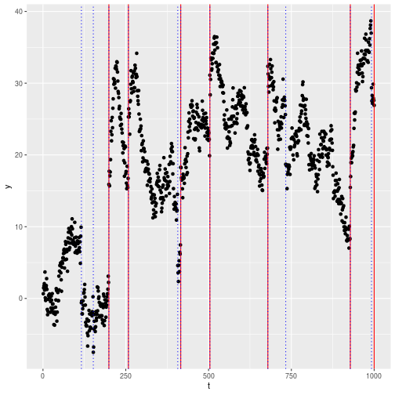

## Installation and Requirements

### Installing the package

To install the package from Github: 


```r
# devtools::install_github("PATHTOREPO/l2FPOP")
library(l2FPOP)
```


Alternatively one could fork this repository, and: 


```r
# devtools::install_github("PATHTOFOLDER/l2FPOP")
library(l2FPOP)
```


### Requirements for the installation

The packages requires `Rcpp` with compiler support for the `std` library introduced with `g++11`.


### Bugs and further queries

If any bug should be spotted, or for any information regarding this package, please email the package mantainer: `g` dot `romano` at `lancaster.ac.uk`.

## Introduction

`l2-fpop` is a `c++` implementation for `R` of the l2-fpop algorithm for performing optimal multiple changepoint detection on some ill-conditioned problems such as detecting a change in mean of the distribution of a Random Walk or on a AR Model for a stream of univariate data.

The main recursion is a variation from the 2005 algorithm Functional Pruning Optimal Partitioning. Let $Y_{1:n} = {Y_1, \dots, Y_n}$ a series of observations centered on the data generating process $X_{1:n}$ with underlying signal $\theta_{1:n}$ where we have no change if $\theta_t = \theta_{t-1}$ and a change otherwise, and finally let $\ell(y, x)$ be a a general statistical loss function, then, l2-fpop finds the optimal solution to the problem:

$$
 \min_{x, \theta \in \mathbb{R}} \left\{  \ell(y, x) + \lambda_1 ||\theta_t - \theta_{t - 1}||_0 + \lambda_2 ||x_t - x_{t - 1}||_2^2 \right\} \ \text{for} \ t \in {1, ..., N}
$$

This is solved via dynamical programming based on the recursion:

$$
Q_{t+1}(x) = \min \left\lbrace Q^*_{\omega,t}(x),\,\min_{x \in \mathbb{R}}\{Q_{t}(x)\} + \beta \right\rbrace + (y_{t+1}-x)^2
$$

where

$$
Q^*_{\omega,t}(x) = \min_{u \in \mathbb{R}}\left(Q_{t}(u) + \lambda_2 (u-x)^2 \right)
$$

It will follow an example based on the Random Walk. 

### Random Walk

One of the cases on which our algorithm can be applied is the Random Walk, also known as standard Brownian motion or Wiener Process. Let $\bf Y$ be a random vector build in the following way:

$$
Y_t = X_t + \epsilon_t^y
$$
with

$$
(X_{t} - \mu_{t}) = (X_{t-1} - \mu_{t-1}) + \epsilon_{t}^x
$$

where $\epsilon_y \sim N(0, \sigma^2_y)$ and $\epsilon_x \sim N(0, \sigma^2_x)$. Then we find a changepoint if $\mu_t \neq \mu_{t-1}$. On this framework, our minimization becomes the following: 

$$
{\min_{\substack{x\in \mathbb{R}^{n+1} \\ \mu \in \mathbb{R}^{n+1} \\ x_0 = \mu_0 = \mu_1}}} 
 \left\{\sum_{i=1}^{n}(y_{i}-x_{i})^2 + \lambda_2 \sum_{i=2}^{n} I(\mu_{i-1} \ne \mu_{i}) + \lambda_2 \sum_{i=2}^{n} ((x_{i}-\mu_{i})-(x_{i-1} - \mu_{i-1}))^2 \right\}
$$

Where our $\lambda_2 = \frac{\sigma_y^2}{\sigma_x^2}$.

# Quick Start

This demo shows some of the features present in the `l2FPOP` package. 

Three functions at the moment are present in the package:


|functions          |description                                                              |
|:------------------|:------------------------------------------------------------------------|
|l2fpop             |Main function to run the l2-FPOP algorithm on a sequence of observations |
|dataRW             |Generate a realization of a RW process plus noise                        |
|estimateParameters |Estimate the parameters sigma_x, sigma_y of a RW                         |

At the moment only two functions for data generation and parameter estimation are present, and they all are tailored for the Random Walk. Since l2-FPOP can tackle also other Stochastic Processes, more functions are expected to be added.

### The `l2-fpop` function

The `l2-fpop` function takes as input the following arguments:

- `y`: the sequence of observations we want to run the algorithm on;
- `l0penalty`: the penalty for the l0 norm in our minimization (what is commonly known as `beta` in the litterature);
- `l2penalty`: the penalty for the l2 norm;
- `type`: the type of costraint to apply to the recursion. At the moment only the standard change ("std") and the isotonic regression ("isotonic") are implemented.

### A simple Random Walk example

We will start generating a Random Walk. The function `dataRW` takes in:

- the length of the sequence of observations,
- a poisson parameter regulating the probability of seeing a jump,
- the average magnitude of a change,
- the $\sigma_x$ and the $\sigma_y$.


```r
set.seed(42)
Y = dataRW(n = 1e3, poisParam = 0.01, meanGap = 20, sdX = 1, sdY = 1)
y = Y$y
```

Running l2-FPOP is fairly straightforward. We need to pass the $\lambda_1$ parameter for the penalty (called `l0penalty`) as well as the $\lambda_2$ (called `l2penalty`)
In this case, since it's random walk, we will use $\lambda_1 = 2 \ \sigma_y^2 \ log(n)$ we discussed in the paper and the $\lambda_2 = \frac{\sigma_y^2}{\sigma_x^2}$.


```r
(res = l2fpop(y, l0penalty = 2 * log(length(y)), l2penalty = 1))
```

```
## $changepoints
## [1]  235  320  480  573  588  594  761  917 1000
```

We plot our segmentation (red lines), alongside with our real segmentation (dotted blue lines).



It seems that in this case the algorithm has missed only one change-point. Let's reduce the average jump size and increase the $\sigma_y$ noise and repeat the experiment:


```r
set.seed(42)
Y = dataRW(n = 1e3, poisParam = 0.01, meanGap = 10, sdX = 1, sdY = 3)
y = Y$y

res = l2fpop(y, l0penalty = 2 * (3^2) * log(length(y)), l2penalty = (3^2) / 1)
```

We plot again the results:


### Isotonic regression

This implementation can also perfom isotonic regression case. Using a different constraint function ($Q^{\leq}(\mu)$), we are now able to pick only up changes. We change the parameter (type) which defines the type of constraint we're using.


```r
set.seed(43)

Y = dataRW(n = 1e3, poisParam = 0.01, meanGap = 10, sdX = 1, sdY = 1)
y = Y$y

res = l2fpop(y, 2 * log(length(y)), 1, type = "isotonic")

ggplot(data.frame(t = 1:length(y), y), aes(x = t, y = y)) +
  geom_point() +
  geom_vline(xintercept = res$changepoints, color = 2) +
  geom_vline(xintercept = Y$cp, col = 4,  lty = 3)
```



## Contributing to this package

If you have interest to contribute to this package, please do not esistate to contact the maintainer:  `g` dot `romano` at `lancaster.ac.uk`.
